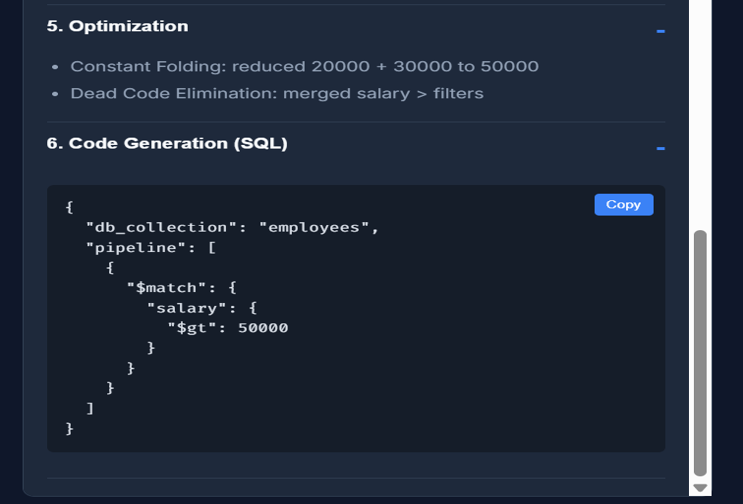
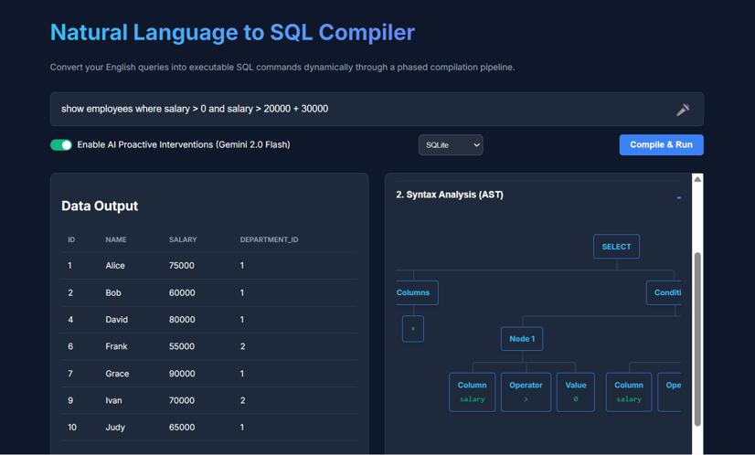
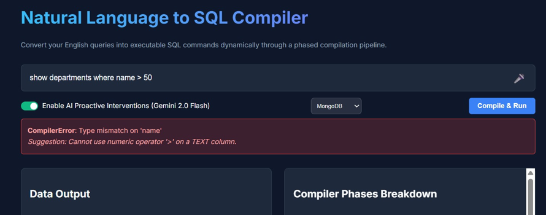

# 🚀 NL to SQL Compiler

<p align="center">


</p>

---

## 📖 Overview

The **NL to SQL Compiler** is an AI-powered web application that converts **Natural Language queries** into executable **SQL statements**. It combines **Google Gemini AI** with **compiler design concepts** such as lexical analysis, parsing, semantic validation, and query optimization to generate accurate SQL queries.

The application supports both **text-based and voice-based query input**, allowing users to interact with the system naturally. The generated SQL is executed on a **SQLite database**, and the results are displayed through an interactive web interface. Users can also **export query results as a PDF** for documentation and reporting purposes.

---

# ✨ Features

- 🤖 AI-powered Natural Language to SQL conversion using Google Gemini AI
- 🎤 Voice-assisted query input for hands-free interaction
- 📝 Text-based natural language query support
- ⚙️ Compiler-inspired multi-phase query processing pipeline
- 🔍 Lexical and syntax analysis
- 🧠 Semantic validation and intelligent error detection
- 🔧 Query optimization before execution
- 🗄️ SQLite database execution
- 📊 Interactive query result visualization
- 📄 Export query results as PDF
- 🌐 Modern and responsive web interface
- 🧩 AST (Abstract Syntax Tree) visualization
- 🧠 Intermediate Representation (IR) generation
- 💻 SQL code generation with copy functionality
- 📝 Clean, modular, and extensible backend architecture
---

# 🏗️ System Architecture


<p align="center">


</p>

---

# 📸 Application Screenshots

## 🏠 Home Page

<p align="center">


</p>

---

## 🧠 Generated SQL

<p align="center">



</p>

---

## 📊 Execution Result

<p align="center">



</p>

---

## ❌ Error Detection

<p align="center">



</p>

---

# ⚙️ Technology Stack

## Frontend

- HTML5
- CSS3
- JavaScript

## Backend

- Python
- FastAPI
- Pydantic

## Database

- SQLite

## AI

- Google Gemini API

## Compiler Components

- Lexer
- Parser
- Semantic Analyzer
- SQL Optimizer

---

# 📂 Project Structure

```text
AI-NL2SQL-Compiler/
│
├── backend/
│   ├── compiler/
│   │   ├── lexer.py
│   │   ├── parser.py
│   │   ├── semantic.py
│   │   ├── optimizer.py
│   │   ├── codegen.py
│   │   ├── diagnostics.py
│   │   └── ir.py
│   │
│   ├── database/
│   │   ├── __init__.py
│   │   └── schema.py
│   │
│   ├── main.py
│   └── test.db
│
├── frontend/
│   ├── index.html
│   ├── style.css
│   └── app.js
│
├── assets/
│   ├── home.png
│   ├── sql_output.png
│   ├── testing.png
│   ├── error.png
│   ├── architectural_diagram.png
│
├── requirements.txt
├── README.md
└── .gitignore
```

---

# 🚀 Installation

## Clone the repository

```bash
git clone https://github.com/sreejamukkara/AI-NL2SQL-Compiler.git
```

## Go to the project folder

```bash
cd AI-NL2SQL-Compiler
```

## Install dependencies

```bash
pip install -r requirements.txt
```

## Start the backend

```bash
cd backend
uvicorn main:app --reload
```

The backend will start at

```
http://127.0.0.1:8000
```

Open `frontend/index.html` in your browser to use the application.

---

# 💡 Example

### Natural Language Query

```text
Show all employees whose salary is greater than 50000.
```

### Generated SQL

```sql
SELECT *
FROM employees
WHERE salary > 50000;
```

---

# 🎯 Future Enhancements

- User authentication
- Query history
- Dashboard with analytics
- Multi-database support

---

# 👩‍💻 Author

**Mukkara Sreeja**

B.Tech Computer Science Engineering

Interested in:
- Artificial Intelligence
- Compiler Design
- Database Systems
- Full Stack Development

GitHub:
https://github.com/sreejamukkara

---

# 📄 License

This project is licensed under the MIT License.

---

⭐ **If you found this project useful, consider giving it a star on GitHub!**
